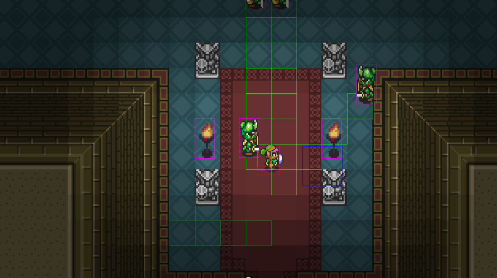
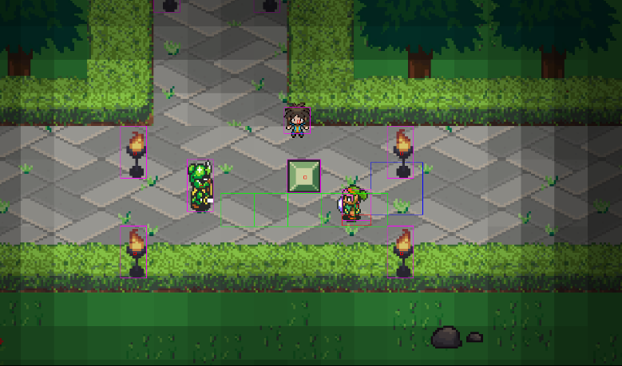

# The Legend of Zelda: A Link to the Past Clone

### Project Preview

## Controls🎮 
- AWSD: Move Around
- J: Sword
- K: Bow
- B: Bomb
- Shift: Dash
- P: Pause
- E: Interact

## Features 
⚡️ Fully Playable Character
⚡️ Data Driven Open World
⚡️ Light System
⚡️ Full World-Object Interaction
⚡️ Enemy AI
⚡️ Win & Loose events
⚡️ NPC Interactions
⚡️ Audio

## Installation & Deployment 📦
- Clone the repository
- Build with Java 14 or newer, and JDK 20 or newer

## License

- **[MIT license](http://opensource.org/licenses/mit-license.php)**

NOTE: All images used in this project are copyright-free and available for non-commercial use